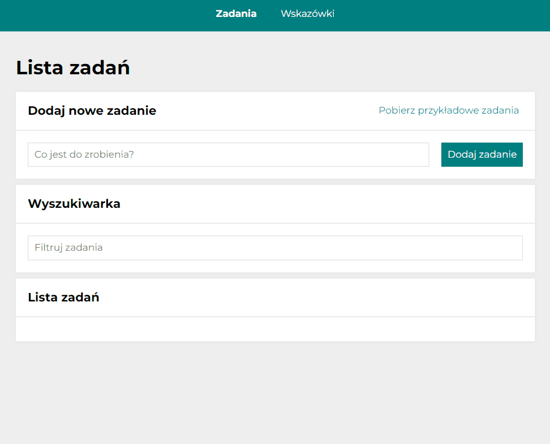

# To Do List App
## Demo

Try it out - [Click here!](https://kajakopczynska.github.io/todo-list-react/)
## Description

This project was made so you can do a simple to-do list:
- You can add a new tasks,
- You can download sample tasks ⬇️,
- You can mark a single task as done ✅,
- You can mark all tasks as done with one click ✅✅✅,
- You can hide completed tasks,
- You can delete tasks 🗑️,
- You can read the details of the task (click on it),
- You can search for a task using the search engine 🔎,
- In a separate tab, you can read about the rules for creating an effective task list 📃.
- Enjoy it 😄!
## How it works

## Technologies

- REACT
- REDUX
- JAVA SCRIPT
- HTML
- CSS
- STYLED COMPONENTS
- GIT
- GITHUB
- VISUAL STUDIO CODE

## Getting Started with Create React App

This project was bootstrapped with [Create React App](https://github.com/facebook/create-react-app).

## Available Scripts

In the project directory, you can run:

### `npm start`

Runs the app in the development mode.\
Open [http://localhost:3000](http://localhost:3000) to view it in your browser.

The page will reload when you make changes.\
You may also see any lint errors in the console.

### `npm run build`

Builds the app for production to the `build` folder.\
It correctly bundles React in production mode and optimizes the build for the best performance.

The build is minified and the filenames include the hashes.\
Your app is ready to be deployed!

See the section about [deployment](https://facebook.github.io/create-react-app/docs/deployment) for more information.

